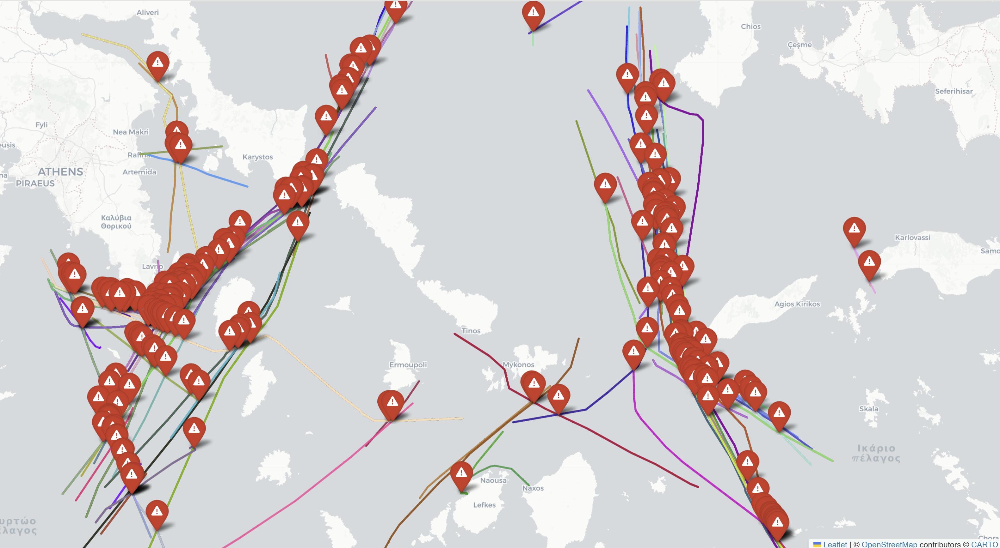
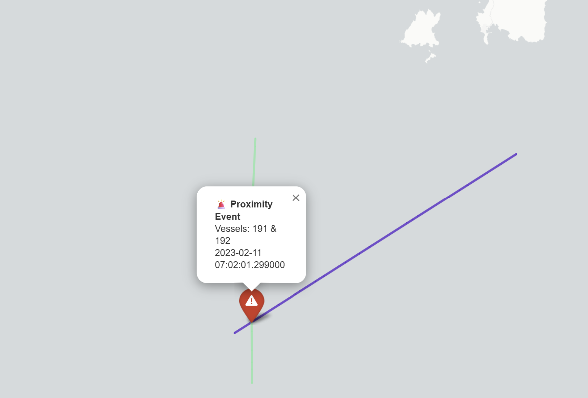

# Maritime Collision Visualizer 🌊🚢  
*A Geospatial Visualization of Synthetic AIS Proximity Events Using Python & Folium*

---

---

## Overview

An interactive geospatial analytics project that visualizes simulated vessel collision proximity (near-collision) events using synthetic AIS (Automatic Identification System) data derived from real-world maritime activity. Using Folium, the system maps vessel trajectories in the Aegean Sea and highlights high-risk proximity encounters with geospatial routes and warning markers.

This open-source project is designed to showcase geospatial data engineering skills in maritime analytics and interactive map development.

---

## 📌 Features

- 🗺️ Interactive folium map displaying vessel paths across the Aegean Sea
- 🎨 Randomized color-coded trajectories for visual vessel separation
- 🔴 Proximity events marked with exclamation-triangle icons
- 🕒 Timestamps included for each vessel position (converted from UNIX epoch)
- ⚓ Minimalistic base map using CartoDB Positron tiles for clarity
- 💡 Lightweight route dots (not markers) for scalability and performance
- 📁 All routes exported to a single `HTML` map, fully interactive offline



---

## 📊 Dataset Summary

### 📦 `vessel_positions.csv`

| Column     | Description                          |
|------------|--------------------------------------|
| vessel_id  | Unique identifier for vessel         |
| t          | UNIX timestamp in milliseconds       |
| lon        | Longitude                            |
| lat        | Latitude                             |
| heading    | Vessel heading                       |
| course     | Vessel course over ground            |
| speed      | Vessel speed in knots                |

~4600 AIS messages across 213 unique vessels

### 📦 `simulated_vessel_proximity_events.csv`

| Column       | Description                          |
|--------------|--------------------------------------|
| vessel_id1   | First vessel involved in the event   |
| vessel_id2   | Second vessel involved               |
| lat          | Latitude of proximity event          |
| lon          | Longitude of proximity event         |
| t            | Event timestamp (UNIX ms)            |

237 simulated unintended proximity events

---

## 📁 Project Structure

```plaintext
ais-vessel-proximity-detection-map-aegean-sea/
│
├── data/                           # 📁 Raw synthetic datasets
│   ├── vessel_positions.csv
│   └── simulated_vessel_proximity_events.csv
│
├── images/                         # 📁 Screenshots of proximity event map
│   ├── screenshot_proximity_event_1.png
│   ├── screenshot_proximity_event_2.png
│   └── screenshot_proximity_events.png
│
├── notebooks/                      # 📁 Jupyter notebooks
│   └── maritime_collision_map.ipynb
│
├── maritime_collision_visual_map.html  # 🌍 Standalone interactive map
├── .gitignore                     # 🙈 Ignore files for Git
├── LICENSE                        # 📄 Open source license
├── README.md                      # 📘 Project documentation
└── requirements.txt               # 📦 Python dependencies
```

---

## 🌐 Attribution

Synthetic AIS Dataset of Vessel Proximity Events provided by the CREXDATA Project, funded by the European Union’s Horizon Europe Programme (Grant agreement No. 101092749).  

🔗 DOI: [10.5281/zenodo.8358664](http://dx.doi.org/10.5281/zenodo.8358664)  
📍 Aegean Sea – Simulated collision trajectories for maritime safety modeling  
📊 213 vessels, 237 proximity events, ~4600 AIS messages  
📚 Mapping Libraries: Folium, CartoDB Positron Tiles  
📜 License: [Creative Commons Attribution 4.0 International (CC BY 4.0)](https://creativecommons.org/licenses/by/4.0/legalcode)

---

## 📜 License

[MIT License](LICENSE)

