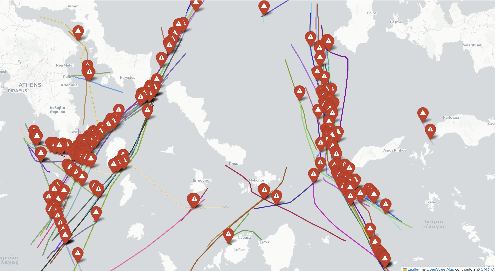
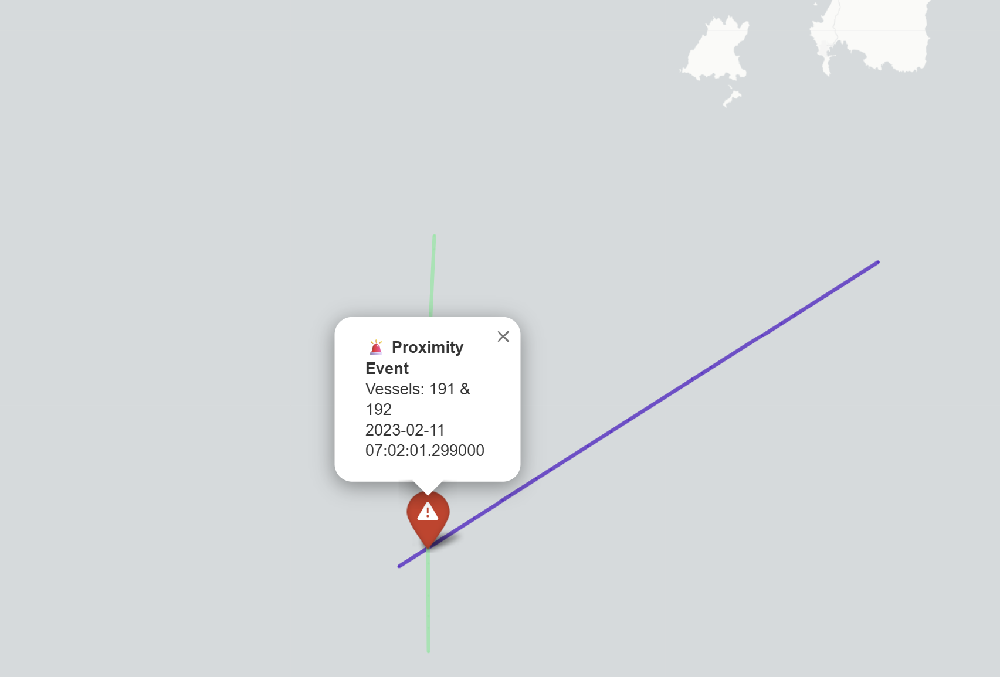
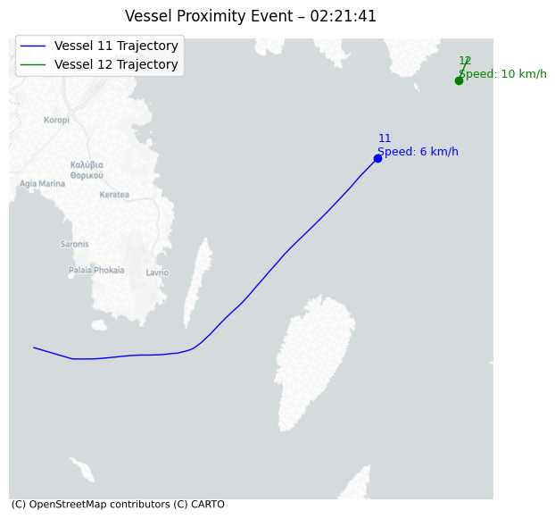
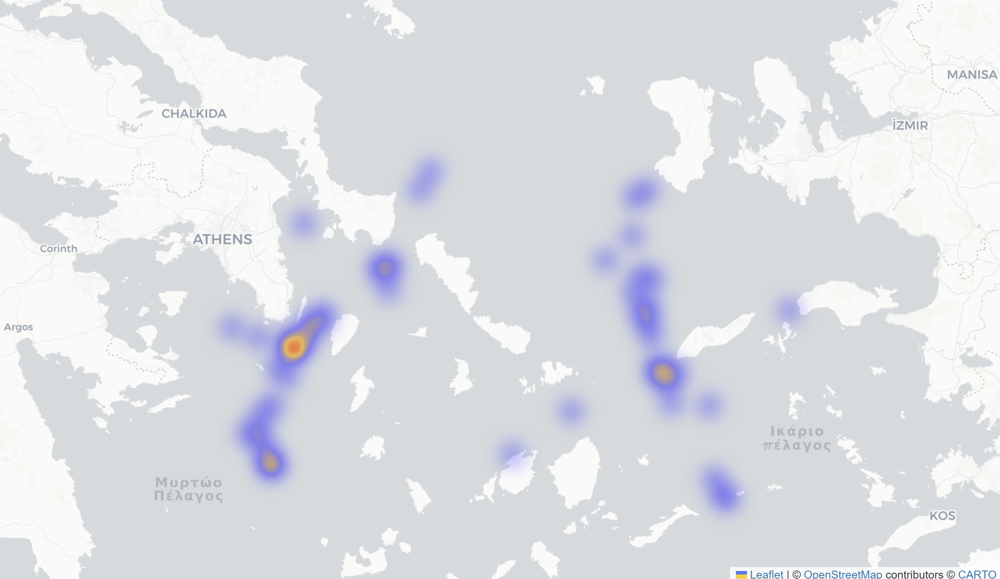

# 📡🛰️ Geospatial Modeling of Vessel Proximity Risk with Synthetic AIS Data 🌊🚢  
*A Geospatial intelligence project exploring near-collision vessel events using Python, synthetic AIS data, and lightweight risk modeling.*

---

---

## Overview

This project investigates **vessel proximity risk** using synthetic AIS (Automatic Identification System) data derived from real-world maritime patterns. Focusing on the Aegean Sea, it simulates near-collision events and visualizes them through interactive maps, spatial risk models, and animated replays.

As maritime traffic intensifies, particularly in geopolitically sensitive or operationally constrained regions, understanding convergence patterns between vessels becomes critical for safety, logistics resilience, and policy awareness.

Using Python and open geospatial tools, the project applies **spatiotemporal proximity logic** to classify risk levels based on vessel distance and timing.

The work demonstrates how **open data and lightweight modeling** can inform **maritime situational awareness and operational decision-making**.

---

## 📌 Features

- 🗺️ **Interactive folium map** displaying vessel paths across the Aegean Sea
- 🎨 **Randomized color-coded trajectories** for visual vessel separation
- 🔴 **Proximity events** marked with exclamation-triangle icons
- 🕒 **Timestamps** included for each vessel position (converted from UNIX epoch)
- ⚓ **Minimalistic base map** using CartoDB Positron tiles for clarity
- 💡 **Lightweight route dots** (not markers) for scalability and performance
- 📁 **All routes** exported to a single `HTML` map, fully interactive offline
- 📊 **Rule-based risk modeling** with distance + time gap classification  
- 🧠 **Risk heatmap** showing spatial density of high/medium-risk encounters  
- 🎞️ **Animated proximity event GIF** showing vessel trajectories, collision course, and timestamps



---

## 📊 Dataset Summary

### 📦 `vessel_positions.csv`

| Column     | Description                          |
|------------|--------------------------------------|
| vessel_id  | Unique identifier for vessel         |
| t          | UNIX timestamp in milliseconds       |
| lon        | Longitude                            |
| lat        | Latitude                             |
| heading    | Vessel heading                       |
| course     | Vessel course over ground            |
| speed      | Vessel speed in knots                |

~4600 AIS messages across 213 unique vessels

### 📦 `simulated_vessel_proximity_events.csv`

| Column       | Description                          |
|--------------|--------------------------------------|
| vessel_id1   | First vessel involved in the event   |
| vessel_id2   | Second vessel involved               |
| lat          | Latitude of proximity event          |
| lon          | Longitude of proximity event         |
| t            | Event timestamp (UNIX ms)            |

237 simulated unintended proximity events


---

## 🧠 Risk Modeling Logic

Using distance and time gap thresholds, proximity events are classified into four levels:

| Risk Level | Distance (NM) | Time Gap (sec) |
|------------|----------------|----------------|
| High       | < 0.5          | < 60           |
| Medium     | < 1.0          | < 120          |
| Low        | < 2.0          | < 300          |
| Very Low   | ≥ 2.0          | ≥ 300          |


---

## 📁 Project Structure

```plaintext
AIS-Vessel-Proximity-Detection-Map-Aegean-Sea/
│
├── data/                               # 📁 Raw synthetic datasets
│   ├── vessel_positions.csv                   # 📊 Vessel position data
│   └── simulated_vessel_proximity_events.csv  # 📊 Simulated proximity event data
│
├── images/                             # 📁 Screenshots and animations
│   ├── screenshot_proximity_event_1.png       # 📸 Single proximity marker
│   ├── screenshot_proximity_event_2.png       # 📸 Alternative event view
│   ├── screenshot_proximity_events.png        # 📸 Overview of multiple events
│   ├── vessels_11_12_proximity.gif            # 🎞️ Animated near-collision replay
│   └── screenshot_risk_heatmap.png            # 📸 Heatmap of high-risk areas
│
├── notebooks/                          # 📁 Jupyter notebooks
│   ├── 01_maritime_collision_map.ipynb        # 📓 Static map of vessel trajectories
│   ├── 02_animated_proximity_event_map.ipynb  # 📓 Animated event replay (GIF output)
│   └── 03_proximity_risk_modeling.ipynb       # 🧠 Risk classification + heatmap modeling
│
├── outputs/                            # 📁 Model outputs (generated programmatically)
│   ├── proximity_risk_events.csv             # 📄 Table of classified proximity risks
│   ├── proximity_risk_map.html               # 🌍 Interactive marker map (by risk level)
│   └── proximity_risk_heatmap.html           # 🔥 Spatial heatmap of medium/high risk
│
├── maritime_collision_visual_map.html  # 🌍 Offline interactive base map (01)
├── .gitignore                          # 🙈 Ignore list for Git versioning
├── LICENSE                             # 📄 Open source license
├── README.md                           # 📘 You are here!
└── requirements.txt                    # 📦 Python package dependencies

```

---

## 🌐 Attribution

**Synthetic AIS Dataset of Vessel Proximity Events** provided by the CREXDATA – Critical Action Planning over Extreme-Scale Data Project, funded by the European Union’s Horizon Europe Programme (Grant agreement No. 101092749). 

Ilias Chamatidis, Giannis Spiliopoulos, Manolis Kaliorakis, Georgios Grigoropoulos, & Konstantina Bereta. (2023). Synthetic AIS Dataset of Vessel Proximity Events (1.0) [Data set]. Zenodo.  
🔗 DOI: [10.5281/zenodo.8358664](http://dx.doi.org/10.5281/zenodo.8358664)  
📍 Aegean Sea – Simulated collision trajectories for maritime safety modeling  
📊 213 vessels, 237 proximity events, ~4600 AIS messages  
📚 Mapping Libraries: Folium, CartoDB Positron Tiles  
📜 License: [Creative Commons Attribution 4.0 International (CC BY 4.0)](https://creativecommons.org/licenses/by/4.0/legalcode)

---

## 📜 License

[MIT License](LICENSE)

---

## 🙋‍♂️ About

Created by **A. Sencer Gözübenli**  
Data Engineer  
*Focusing on supply chain analytics, geospatial risk modeling, and data-informed decision systems.*
